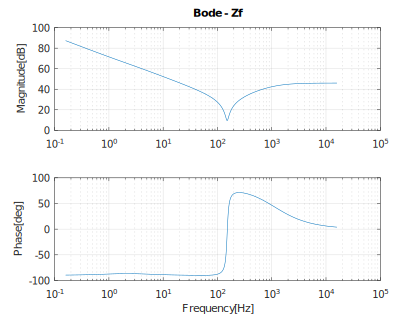
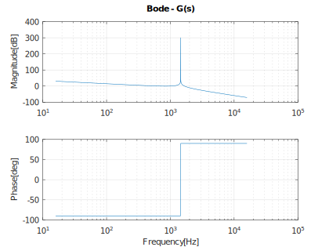

# Filter Circuit Computation

Electrical filter transfer functions and calculations, based on standardised and widely adopted filter designs.

* [Overview](#overview)
* [Octave](#octave)
* [Filters](#filters)
    * [Terminology](#terminology)
    * [C-Type Passive Filter - CTPF](#c-type-passive-filter---ctpf)
    * [LCL Filter](#lcl-filter)

&nbsp;

## Overview

The aim of this repository is to gather concise and useful filter design and response information which may be useful for educational or reference purposes. Most types of electrical filter designs are well documented, but it can often be difficult to find or derive a filter frequency response transfer function to get a feel for the filters characteristic behaviour.

&nbsp;

## Octave

[GNU Octave](https://octave.org/) is used _(as an alternative to [MATLAB](https://www.mathworks.com/products/matlab.html))_ for the computation of filter responses.

&nbsp;

## Filters

### Terminology

- Shunt filters
    - Prevent a particular frequency from entering further into a system by providing a shunt path of low impedance to the relevant frequency.
- Series filters
    - Prevent a particular frequency from entering the system by presenting a large series impedance to the relevant frequency.

&nbsp;

### C-Type Passive Filter - CTPF

| Feature | Comments |
| :------ | :------ |
| Reference paper(s) | Novel Design Methodology for C-type Harmonic Filter Banks Applied in HV and EHV Networks, Randy Horton, Roger Dugan, Daryl Hallmark. DOI 10.1109/TDC.2012.6281629 |
| Use case(s) | Shunt filter. Filtering low order harmonics i.e. up to the 5th harmonic in an AC power system |
| Source code | [ctpf.m](./src/ctpf/ctpf.m) |

_Filter circuit_

_Bode plot (filter impedance)_

&nbsp;

### LCL Filter

| Feature | Comments |
| :------ | :------ |
| Reference paper(s) | An Improved LCL Filter Design in Order to Ensure Stability without Damping and Despite Large Grid Impedance Variations, Marwa Ben Said-Romdhane, Mohamed Wissem Naouar, Ilhem Slama Belkhodja, and Eric Monmasson. DOI 10.3390/en10030336 |
| Use case(s) | Series filter. The main objective of the LCL filter is to reduce the high-order current harmonics at the inverter switching frequency |
| Source code | [lcl.m](./src/lcl/lcl.m) |

_Filter circuit_

_Bode plot (filter impedance)_

&nbsp;

